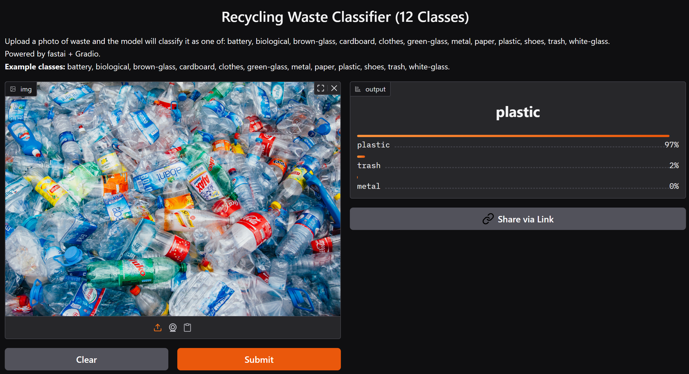
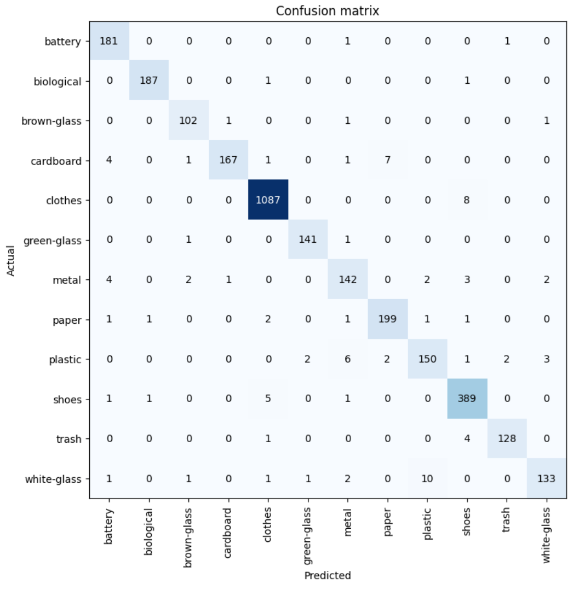

# Recycling Waste Classifier ♻️

An AI-powered web app to automatically classify recyclable waste into 12 categories from a photo.  
Built with fastai, Gradio, and deployed on Hugging Face Spaces.

---

**Live Demo:** [Try it on Hugging Face Spaces](https://huggingface.co/spaces/Talip7/recycling_waste_classifier)  
**Author:** [Talip7](https://huggingface.co/Talip7)
---

## ✨ Features

- Classifies waste images into 12 classes (battery, biological, glass, plastic, etc.)
- Simple drag-and-drop or click-to-upload interface
- Top-3 predictions with confidence scores
- Built with transfer learning (ResNet34 + fastai)
- Deployed and sharable, no setup needed for demo!

---

## 📊 Example Output



---

## 🏗️ Tech Stack

- **Python**
- **fastai** (ResNet34, data augmentation)
- **Gradio** (web interface)
- **Hugging Face Spaces** (deployment)

---

## 📦 Dataset

- Public Garbage Classification dataset (~15,500 images, 12 categories)
- Each class: battery, biological, brown-glass, cardboard, clothes, green-glass, metal, paper, plastic, shoes, trash, white-glass

---

## 🔽 Download the Pre-trained Model

You can download the pre-trained model here:  
👉 [recycling_classifier_12class.pkl (direct download)](https://huggingface.co/spaces/Talip7/recycling_waste_classifier/resolve/main/recycling_classifier_12class.pkl)  
Or browse all project files on [Hugging Face Spaces](https://huggingface.co/spaces/Talip7/recycling_waste_classifier/tree/main).

**Place the downloaded `.pkl` file in the project root folder before running the app.**

---

## 🧑‍💻 How to Run Locally

1. **Clone the repo:**
    ```bash
    git clone https://github.com/yourusername/recycling-waste-classifier.git
    cd recycling-waste-classifier
    ```

2. **Install dependencies:**
    ```bash
    pip install -r requirements.txt
    ```

3. **Download the trained model:**
    - (If not included) Download `recycling_classifier_12class.pkl` and place it in the project directory.

4. **Run the app:**
    ```bash
    python app.py
    ```
    Open [http://localhost:7860](http://localhost:7860) in your browser.

---

## 🏆 Results

- **Accuracy:** *96.9%*
- **Confusion Matrix:**

  

---

## 📄 License

MIT

---

*Made with ❤️ by [7Talip](https://github.com/7Talip)*

